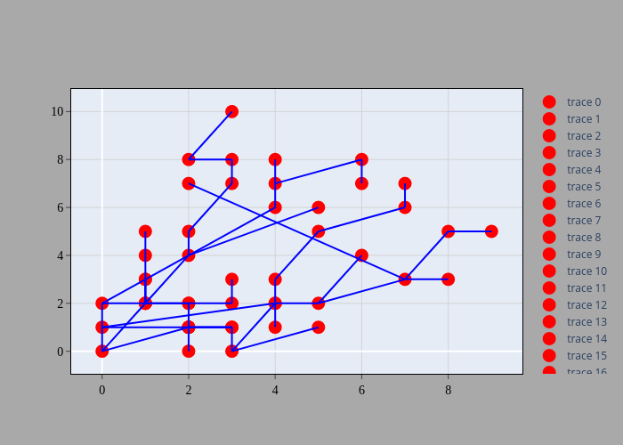
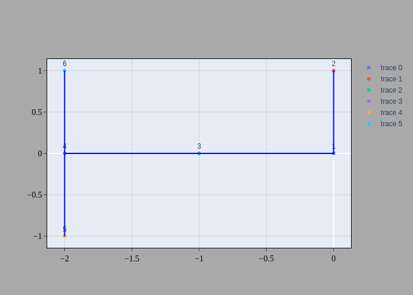

# P.L.U.M.E

Procedural Lava-Tube Underground Modeling Engine: A generator that uses procedural generation techniques and graph algorithms to create detailed and visually appealing lava tube structures.

## Algorithms
The generator use a selected algorithm to create the graph shape. Then once the underground skeleton is created using graph, the Blender API is required to create the mesh around it. The benefit of this method would first be the large number of generated mesh that could be created within a minute. Then the resulted mesh highly depends on the used algorithm and given parameters so the generator is thoroughly tunable.

### Probabilistic
pass

### Voronoi
The Voronoi tessellations (or Dirichlet tessellations) is an algorithm.

More informations [here](https://hpaulkeeler.com/voronoi-dirichlet-tessellations/)

### Fibonacci Lattice
pass

## Metric distorsion
Once generated, the graph could be distorted to create an even more realistic and organic shape.

## Mesh creation
During this project, I decided to use Blender API to create the mesh based on the graph skeleton. Blender has a wide community that allows me to 

## Setup
### Requirements
- Python >= 3.8
- numpy >= 1.21.4
- pyglet >= 1.5.21

### Launch the generator
To initiate procedural generation, run the `generation.py` file using pyglet version 1.5.21 or higher. It's important to note that this generator is not compatible with Python 2.x.

## Results

    
    
Chaotic generation

    
    
Latest generation

