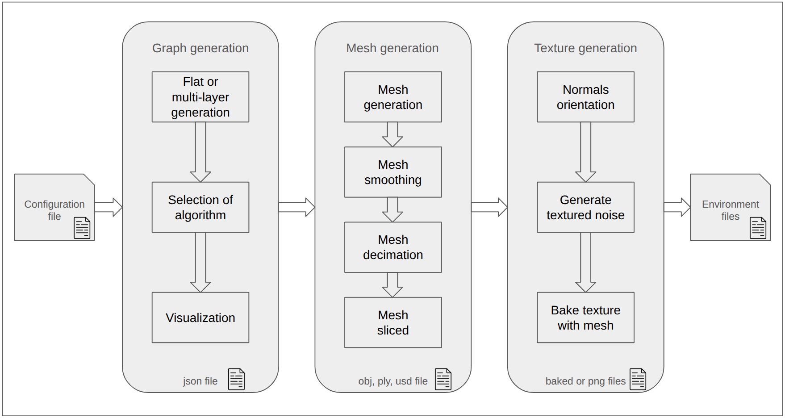
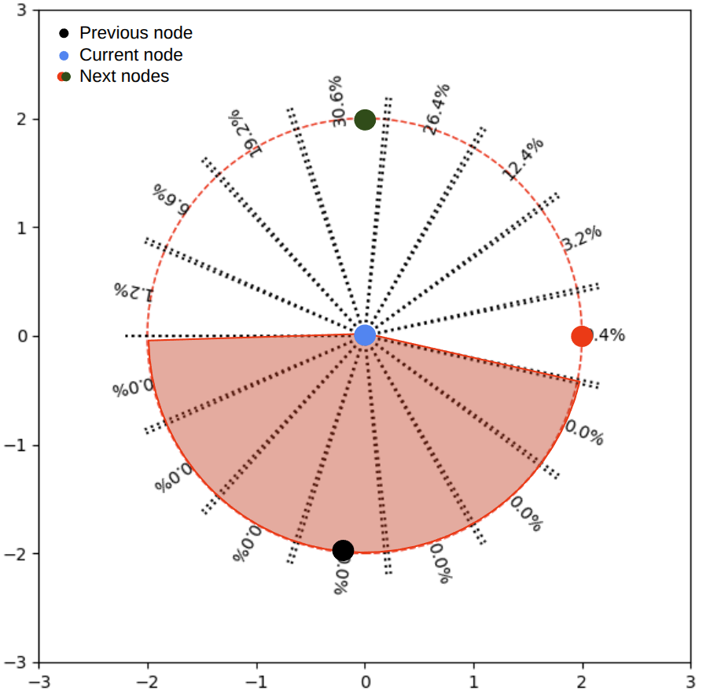
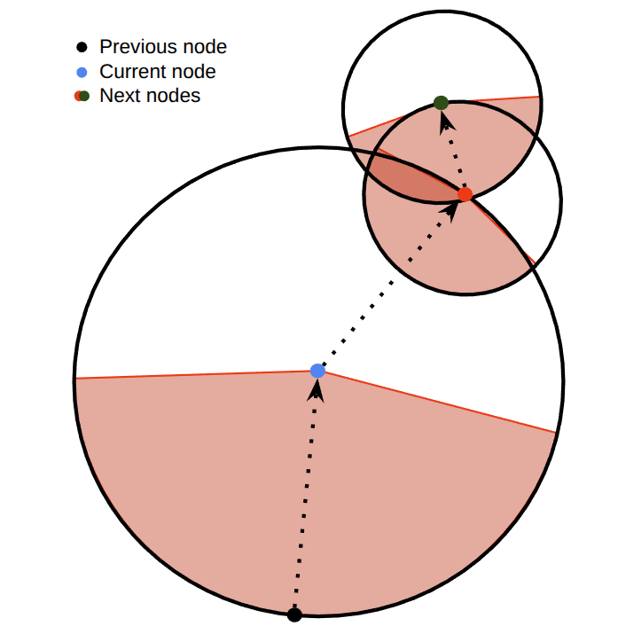
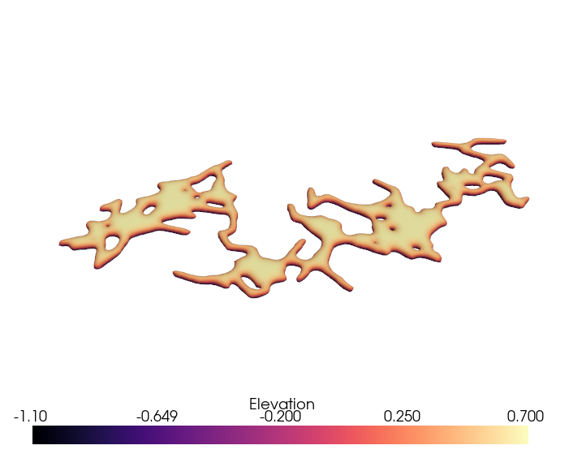
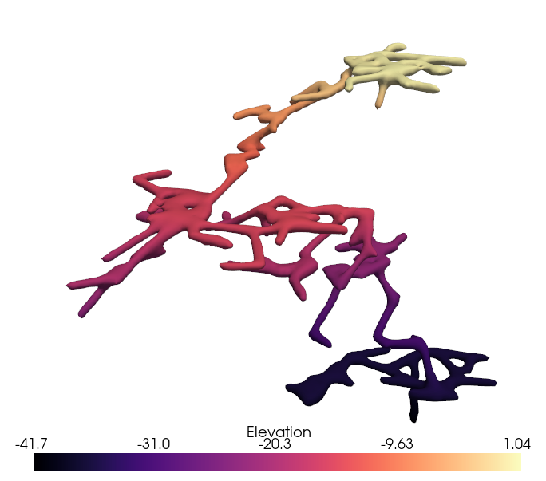
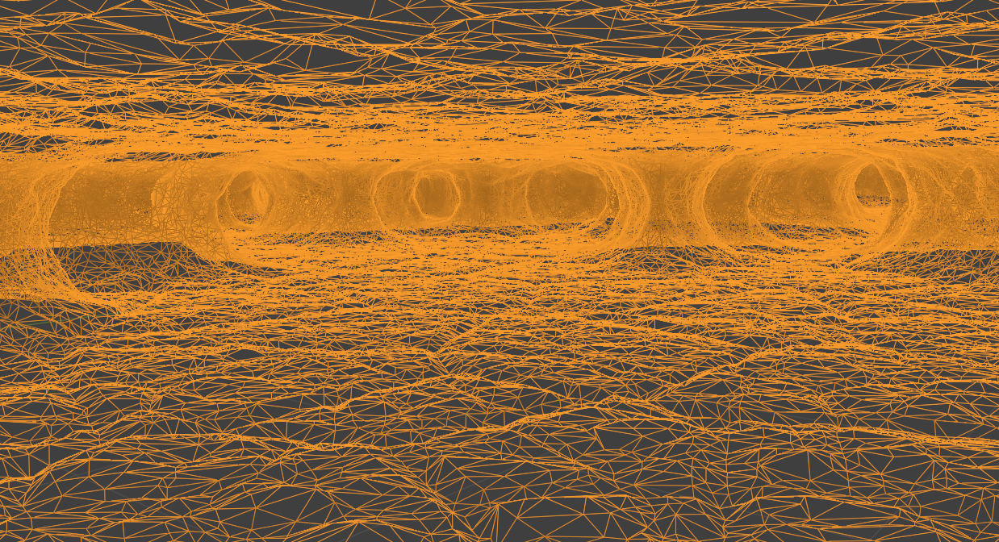
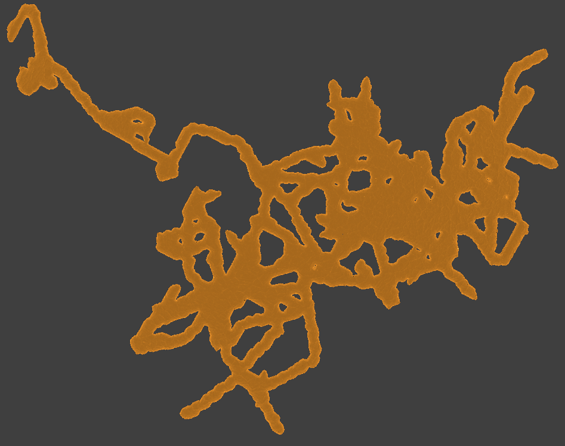
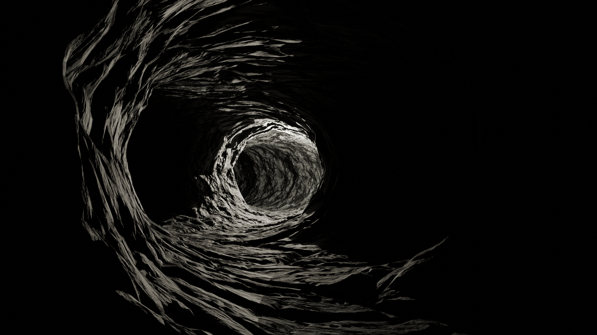
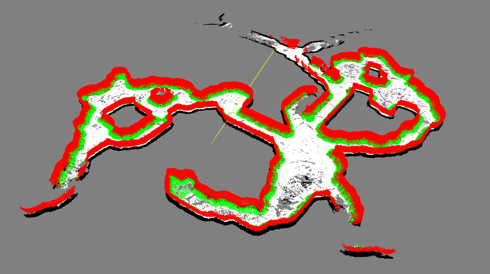

# P.L.U.M.E

Procedural Layers Underground Modeling Engine: A generator that uses procedural generation techniques and graph algorithms to create detailed and visually appealing underground structures.


<div align="center">
    
    <div align="center">Inside of a cave</div>
</div>


## Description
PLUME is a Blender-based pipeline that generates 3D meshes and high-quality textures of various types of underground environments. It is modular enough to be easily extended with other graph algorithms. The currently generated environment can take the form of a mine or a cave, but with a huge focus on the latter. 

### Overview
<div align="center">
    
    <div align="center">Pipeline overview</div>
</div>

As seen in the figure above PLUME is composed of three distinct stages: Graph generation, mesh generation and texture generation.

Each stage is composed of distinct blocks that represent the generation steps within a stage. However, some blocks are optional and can be skipped either to speed up the generation time or because they are not needed for the desired environment.

### Graph generation
The first stage is the graph generation, also known as the "skeleton" of the underground environment.

The current implementation of PLUME uses a probabilistic distribution on a circle created around the selected node. This distribution provides an overall direction to the created node on the circle while incorporating some randomness. To prevent the graph from circling on itself, a forbidden zone has been implemented (Represented with a zero probability).

<div align="center">
  <figure style="display: inline-block; text-align: center; margin: 0 20px;">
    
    <figcaption>Probability distribution</figcaption>
  </figure>
  <figure style="display: inline-block; text-align: center; margin: 0 20px;">
    
    <figcaption>Graph generation</figcaption>
  </figure>
</div>


Two different types of generation are distinguished: single and multi-layer generation. The single layer generates the graph on a 2D plane, whereas the multi-layer is a combination of several single layers on top of each other, connected by passages. The slope angle of those passages can be fine-tuned in the configuration file. 

<div align="center">
  <figure style="display: inline-block; text-align: center; margin: 0 20px;">
    
    <figcaption>Single layer generation</figcaption>
  </figure>
  <figure style="display: inline-block; text-align: center; margin: 0 20px;">
    
    <figcaption>Multi layer generation</figcaption>
  </figure>
</div>


### Mesh generation
The second stage of the generation is the mesh generation using Blender. At this stage, a skin is created along the skeleton represented by the graph. Different smoothing and noise algorithm are then applied to the mesh further strengthening the details.
<div align="center">
<table>
  <tr>
    <td align="center">
      <br>
      <sub>Inside of a room (wireframe view) - Blender</sub>
    </td>
    <td align="center">
      <br>
      <sub>Top-down view - Blender</sub>
    </td>
  </tr>
</table>
</div>

### Texture generation
The last stage of the generation is the texture baking using Blender. Textures have been generated procedurally along with the mesh (before slicing it to keep visual harmony), but they are baked along with it later. The resolution of the texture has a significant impact on the generation time, the result size, and the visual fidelity.

## Visuals
Along with the first visual provided at the top of this readme, here are some more visuals using Blender and the Cycle engine.

The first picture shows a larger room with some elevation that appears to be challenging for the robots. On the other hand, the middle picture shows a narrow passage with only one light source and high contrast. The last picture displays the same environment as the second picture, but with different lighting conditions, showing more details about the structure and diminishing the overall contrast.

<div align="center">
  <figure style="display: inline-block; text-align: center; margin: 0 20px;">
    
    <figcaption>Large room</figcaption>
  </figure>
  <figure style="display: inline-block; text-align: center; margin: 0 20px;">
    
    <figcaption>High contrast</figcaption>
  </figure>
  <figure style="display: inline-block; text-align: center; margin: 0 20px;">
    
    <figcaption>Medium contrast</figcaption>
  </figure>
</div>


All those figures demonstrate the PLUME capabilities and the potential environment where robots and rovers can evolve.

## Installation

All the commands below assume that you cloned the repository.

```bash
$git clone https://gitlab.com/uniluxembourg/snt/spacer/plume.git
```

### Requirements
- Ubuntu >= 20.04
- Blender >= 3.4

### Libraries installation
Before delving into the project, it is strongly recommended to use a virtual environment. At the root directory of the PLUME project, use this command:

Install the virtual environment package on your OS.
```bash
/plume$ sudo apt install python3-venv
```

Create a virtual environment at the root of the PLUME project.
```bash
/plume$ python3 -m venv venv
```

Once the virtual environment directory created please activate it:

```bash
/plume$ source venv/bin/activate
```

You should now have `(venv)` at the beggining of your termial line.
Execute this line to install all the libraries in your virtual environment:

```bash
/plume$ pip install -r requirements.txt
```
Once the installation is completed. Your environment should now be ready.


### Launch the generator
To initiate procedural generation, run the [`generation.py`](./src/generation.py) file. It's important to note that this generator is not compatible with Python 2.x.

```bash
$ python3 src/generation.py
```

It is also possible to add specific arguments to the command line:
- \-h Open help
- \-n <name> Name of the current graph generation (Time and date will be automatically added to it). No space allowed.
- \-g <path> Takes an already generated graph as an input. Allow the user to regenerate the same graph with different mesh and texture settings.

Usage example:
```bash
$ python3 src/generation.py -name Chanel
```


### Configuration file
The [`config.py`](./src/config.py) script is a configuration module providing essential settings and parameters for a Python project. It defines configuration options using enumerations, which are likely used across the project for consistency in settings and console outputs.
#### General Settings

- `NB_GENERATION`: Number of underground generations to create (they will be created under `data/<name_of_generation>/<index>/`).
- `GENERATION_SIZE`: Size of the generated environment (cube of x,y,z)
- `TYPE_OF_UNDERGROUND`: Type of underground structure ('CAVE' or 'MINE' - MINE not available yet).
- `THREE_DIMENSION_GENERATION`: Boolean flag to choose if the generation will use the z axis or not.
- `NB_NODES`: Default minimum number of nodes (more nodes = larger environment).
- `IMAGE_FORMAT`: Format of generated images (e.g., ".png").
- `THEME`: String, use light or dark mode to save the graph picture visualisation. Available: white, dark
- `OPEN_VISUALIZATION`: Boolean flag to open visualization after generation (does not save it).
- `GENERATE_GRAPH_IMAGE`: Boolean flag to make and save a graph visualisation image.
- `MESH_FORMAT`: Format of generated 3D meshes (options: 'obj', 'ply', 'usd').
- `SAVE_MESH`: Boolean flag to save generated 3D meshes.
- `GENERATE_MESH`: Boolean flag to generate 3D meshes (and texture).
- `BAKE_TEXTURE`: Boolean flag to bake, save and export the textures
- `TEXTURE_SIZE`: Size of textures (options: 16384, 8192, 4096, 1024 pixels).
    - 8K texture requires 32GB of RAM or more (could use swap).
    - 16K texture requires 64GB of RAM or more (could use swap).
    - In order to have a nice texture result, 8K or more is strongly recommended.

#### Advanced Settings

- `MAX_CREATED_NODE_ON_CIRCLE`: Maximum number of nodes created on a circle (more nodes on a circle = denser environment and more likely to fetch large rooms).
- `MAX_RADIUS_NODE`: Maximum radius of a node (Density of the nodes).
- `DEFAULT_LOOP_CLOSURE_PROBABILITY`: Default probability for loop closure.
- `SELECTED_ALGORITHM`: Selected algorithm for generation ('gaussian_perlin').
- `MAX_MESH_TRIANGLES`: Upper threshold of triangles in the generated mesh.
- `FINAL_DECIMATION`: Boolean flag to choose whether or not to reduce the number of polys after the textures are baked and applied.
- `FINAL_DECIMATION_FACTOR`: Float that represents the ratio between the current number of polys of the mesh and the final number of polys ]0,1[.
- `GPU_ACCELERATION`: Boolean flag for GPU acceleration.
- `PARALLELIZATION`: Boolean flag to speed up the generation of the graph using all the cores of the computer.
- `HIGH_POLY`: Boolean flag to specify if the generation has to be low or high poly. High poly generation involves many details, which may require higher textures, potentially slowing down the generation process. Higher poly generation adds additional processing time
- `SLICE_MESH`: Boolean flag that activates the mesh slicing into chunks.
- `NUMBER_OF_CHUNKS`: Integer, select the number of divisions along each axis. (be aware, using 4 does not mean 4 chunks but rather 4 divisions. aka 4*4 in single layer generation and 4*4*4 in multi layer generation)
- `DEBUG`: Open the Blender visualisation for debugging.


## Usage
PLUME was used to create a cave-like environment, which was later exported to the simulation software Gazebo. Following this, a SLAM algorithm utilizing LiDAR input was employed to map and position the robot within the environment.
<p align="center">
    
    <div align="center">Cloud map of a PLUME generation - Foxglove GUI</div>
</p>

As seen in the figure, in the resulting cloud map, all the points above 1 meter have been filtered to prevent the SLAM algorithm from mapping the ceiling. This allows the navigation software to use the resulting projected map.


## Support
For any support on the project, please open an issue on the repository.

## Roadmap
Good additions to the PLUME project would be (but not limited to) those features:
- Lava tubes generation (also called pyroducts)
- Physical based generation of graphs
- Add procedural objects (rocks, mine objects)
- Multi-layer texture (such as slippery texture used in a simulation software)

## License
This project is licensed under the BSD 3-Clause License.  
See the [LICENSE](./LICENSE) file for more information.


## Project status and Contributing

A notable contribution to this project is the implementation of a new graph generation algorithm, achieved by modifying the [`algorithm.py`](./src/algorithm.py) file. A different generation algorithm will lead to a way different underground environment.

This project has been developed by researchers who are now involved in other research-related projects. However, all contributions to this project are welcome.

 ## Citation
 This work has been submitted to [iSpaRo](https://www.isparo.space/) 2025.

 If PLUME helps your research, please cite the paper. Here is a BibTeX entry:

```bibtex
 @inproceedings{PLUME,
  author    = {Gabriel M. Garcia, Antoine Richard, Miguel Olivares Mendez},
  title     = {PLUME: Procedural Layer Underground Modeling Engine},
  booktitle = {Proceedings of the IEEE International Conference on Space Robotics (iSpaRo)},
  year      = {2025},
  address   = {Sendai, Japan},
  publisher = {IEEE},
}
```

 The preprint can be found [here](https://example.com).


