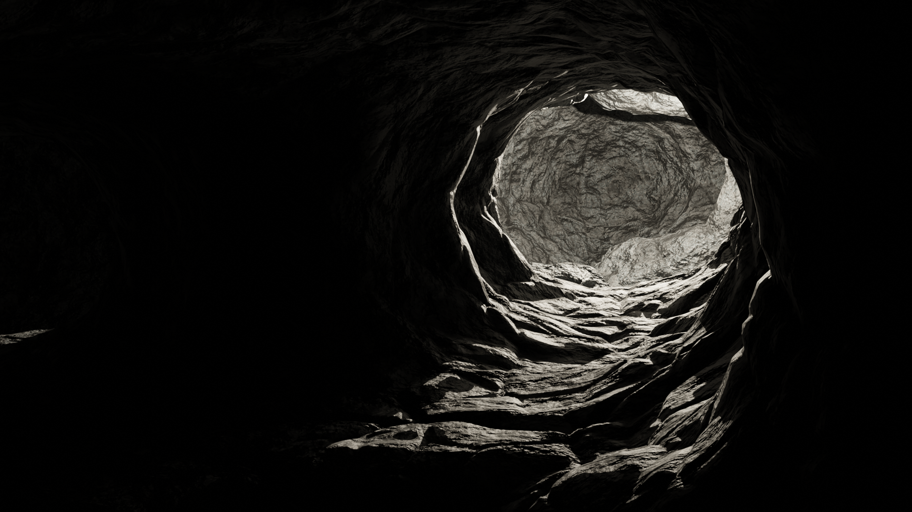

# P.L.U.M.E

Procedural Layers Underground Modeling Engine: A generator that uses procedural generation techniques and graph algorithms to create detailed and visually appealing underground structures.


<p align="center">
    
    <div align="center">Figure 1: Inside of a cave</div>
</p>


## Algorithms
The generator use a selected algorithm to create the graph shape. Then once the underground skeleton is created using graph, the Blender API is required to create the mesh around it. The benefit of this method would first be the large number of generated mesh that could be created within a minute. Then the resulted mesh highly depends on the used algorithm and given parameters so the generator is thoroughly tunable.

### Probabilistic
robability plays an integral role in the generation of random graphs. Here are some key ways it contributes:

Node Connection Probability: As mentioned in the Erdős-Rényi model, for every pair of nodes, an edge is created based on a specified probability. This randomness influences the structure of the generated graph, making it different each time it is generated.

Weight Assignment: In weighted graphs, probability can dictate the weight (or cost) assigned to the edges. For instance, a random number from a given distribution can be assigned as the weight of an edge. In our case it will only be a Poisson distributon (0 or 1).

Type of Distribution: The distribution type selected for generating the probability can heavily influence the graph's characteristics. For instance, in preferential attachment models (like the Barabási-Albert model), the probability that a new edge has one endpoint at a node (existing in the graph) is proportional to the node's degree. This creates a "rich-get-richer" effect, resulting in a scale-free network that has nodes (called hubs) with a degree much larger than the average.

Choosing the Type of Graph: The graph's nature (directed, undirected, weighted, unweighted) can also be determined probabilistically. This choice will, in turn, influence the way the graph is generated and structured.

Determining Node and Edge Attributes: Probability can be used to randomly assign attributes to nodes and edges. These attributes could represent various properties of the node/edge in the modeled system, and the randomness could represent the inherent variability in those properties in the real world.

Control the Density of the Graph: The probability can control the number of edges in the graph, and hence, the density or sparseness of the graph. A higher probability will lead to a denser graph with more edges, and a lower probability will generate a sparser graph.

In all these ways, probability provides a way to introduce randomness and variability into graph generation, helping to create more realistic and varied models of complex systems.


### Voronoi
The Voronoi tessellations (or Dirichlet tessellations) is an algorithm.

More informations [here](https://hpaulkeeler.com/voronoi-dirichlet-tessellations/)

Voronoi tessellation is a mathematical concept named after Georgy Voronoi, a Russian mathematician. It is also referred to as Voronoi diagram, Voronoi partition, or Voronoi decomposition.

In the simplest terms, a Voronoi tessellation of a plane with a set of distinct points is a partitioning of that plane into regions. Each region corresponds to a specific point and contains all locations in the plane that are closer to this point than to any other.

Here is a step-by-step process of how it's constructed:

- Start with a set of points on a plane, known as "seed" points.
- For each seed point, construct a region consisting of all the points that are closer to this seed than to any other. This is done by drawing boundaries which are equidistant between pairs of seed points.
- The end result is a mosaic of polygons, each associated with one seed point and containing all the points closer to that seed point than to any other. These polygons are called Voronoi cells.

Voronoi tessellations are used in a variety of field but could be used to generate graphs that are not based on a perfect grid shape. In our case it break the "grid-like" shape generation used for our algorithm.


### Fibonacci Lattice
Fibonacci Lattice, also known as Fibonacci grid or Fibonacci spiral, is a geometric distribution of points in a disk, placing points in a very regular but non-uniform manner. It is frequently used in computer graphics and computational geometry due to its properties.

In the context of organic graph generation, the Fibonacci Lattice could be used to create irregularity. Since the points in the Fibonacci Lattice are distributed in a non-uniform way, the graph nodes derived from these points will also be non-uniform. This introduces some irregularity and randomness in the graph, contributing to its 'organic' feel. Additionally, the Fibonacci Lattice can be used for the point distribution generation. It can generate the vertices of a graph, placing them in a way that fills a certain area while maintaining a certain level of distance from each other. This is useful in creating an organic structure as it avoids an overly uniform or random distribution of nodes, instead providing a more natural feel.

## Metric distorsion
Once generated, the graph could be distorted to create a more realistic and organic shape.

In our context, metric distortion, also referred to as distortion or stretch, is a measure of how much a function (typically a mapping or embedding) distorts the distances between points. Instead of having straight lines of defined length, metric distortion could introduce more randomness into the size of our tunnels.

## Mesh creation
During this project, I decided to use Blender API to create the mesh based on a graph skeleton. Blender has a wide community that allows extensive support as well as all the default tools to achieve mesh generation.

## Setup
### Requirements
- Python >= 3.8
- numpy >= 1.21.4
- pyglet >= 1.5.21
- blender >= 3.4

### Install the libraries
Before launching the generation, the library installation is required. To achieve it, it is first recommended to install a Python virtual environment. At the root directory of the PLUME project use this command:

```python
/P.L.U.M.E$ python3 -m venv venv
```

Once the virtual environment directory created please activate it:

```python
/P.L.U.M.E$ source venv/bin/activate
```

You should now have `(venv)` at the beggining of your termial line.
Execute this line:

```python
/P.L.U.M.E$ pip install -r requirements.txt
```
Once the installation is completed. Your environment should now be ready.


### Launch the generator
To initiate procedural generation, run the `generation.py` file using pyglet version 1.5.21 or higher. It's important to note that this generator is not compatible with Python 2.x.

```python
$ python3 src/generation.py
```

It is also possible to add specific arguments to the command line:
- \-h Open help
- \-name <name> Name of the current graph generation (Time and date will be automatically added to it). No space allowed.

Example:
```python
$ python3 src/generation.py -name Chanel
```


### Configuration file
The `config.py` script is a configuration module providing essential settings and parameters for a Python project. It defines configuration options using enumerations, which are likely used across the project for consistency in settings and console outputs.
#### General Settings

- `NB_GENERATION`: Number of underground generations to create (they will be created under `data/<name_of_generation>/<index>/`).
- `IMAGE_FORMAT`: Format of generated images (e.g., ".png").
- `MESH_FORMAT`: Format of generated 3D meshes (options: 'obj', 'ply', 'usd').
- `OPEN_VISUALIZATION`: Boolean flag to open visualization after generation.
- `GENERATE_MESH`: Boolean flag to generate 3D meshes (and texture).
- `SAVE_GRAPH_IMAGE`: Boolean flag to save generated graph images.
- `SAVE_MESH`: Boolean flag to save generated 3D meshes.
- `BAKE_TEXTURE`: Boolean flag to bake, save and export the textures
- `TYPE_OF_UNDERGROUND`: Type of underground structure ('CAVE' or 'MINE' - MINE not available yet).

#### Advanced Settings

- `DEFAULT_MIN_NODES`: Default minimum number of nodes (more nodes = larger environment).
- `MAX_CREATED_NODE_ON_CIRCLE`: Maximum number of nodes created on a circle (more node on circle = denser environment and more likely to fetch large rooms).
- `MAX_RADIUS_NODE`: Maximum radius of a node (Density of the nodes).
- `DEFAULT_LOOP_CLOSURE_PROBABILITY`: Default probability for loop closure.
- `SELECTED_ALGORITHM`: Selected algorithm for generation ('gaussian_perlin').
- `TEXTURE_SIZE`: Size of textures (options: 16384, 8192, 4096, 1024 pixels).
    - 8K texture require 32GB of RAM or more (could use swap).
    - 16K texture require 64GB of RAM or more (could use swap).
    - In order to have nice texture result, 8K or more is strongly recommended.
- `MAX_MESH_TRIANGLES`: Upper threshold of triangles in the generated mesh.
- `FINAL_DECIMATION`: Boolean flag to choose whether or not to reduce the number of polys after the textures are baked and applied.
- `FINAL_DECIMATION_FACTOR`: Float that represent the ratio between the current number of polys of the mesh and the final number of polys ]0,1[.
- `GPU_ACCELERATION`: Boolean flag for GPU acceleration.
- `PARALLELIZATION`: Boolean flag to speed up the generation of the graph using all the cores of the computer.
- `HIGH_POLY`: Boolean flag to specify if the generation has to be low or high poly. High poly generation has a lot of details and therefore might need higher texture that can slow down the generation. On top of that higher poly generation takes longer to generate obviously.
- `THREE_DIMENSION_GENERATION`: Boolean flag to choose if the generation will use the z axis or not.

<br>
For more in depth configuration, please check the documentation under `doc/Config_file.md`.

### Results

<p align="center">
    
    <div align="center">Figure 2: Generated graph</div>
</p>
Figure 2 depicts the topological representation of the synthetic underground environment generated by the procedural algorithm. Each node in the graph corresponds to a key feature in the environment, such as caves or tunnels. The edges between nodes represent spatial relationships, illustrating the connectivity and structure of the generated subterranean landscape. The graph provides a comprehensive overview of the spatial layout and interconnections within the synthetic underground space.
<br>
<br>
<br>


<p align="center">
    
    <div align="center">Figure 3: Generated mesh</div>
</p>

Figure 3 presents a visual representation of the three-dimensional mesh, without textures, generated by the procedural algorithm. The mesh captures the intricate details of the synthetic underground environment, including the geometric arrangement of surfaces and structural elements. This visualization offers insights into the spatial complexity of the generated environment, showcasing the realism and intricacy achieved by the procedural generation process. The mesh visualization serves as a tangible illustration of the synthetic underground landscape, providing a visual reference for further analysis and evaluation.